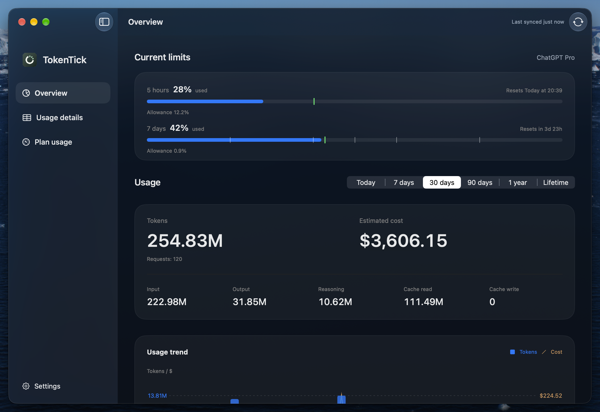
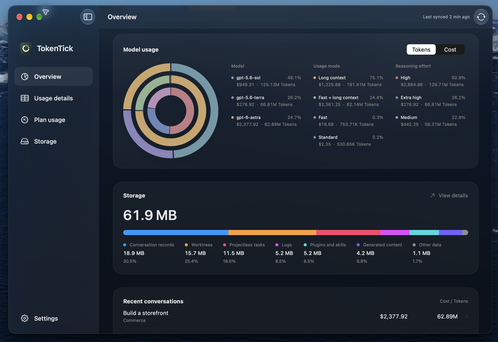
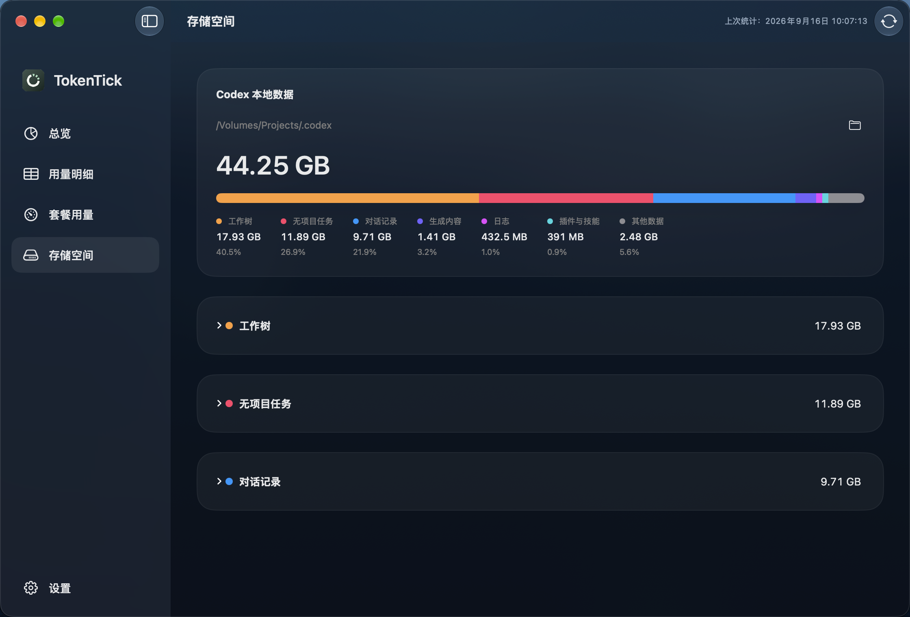
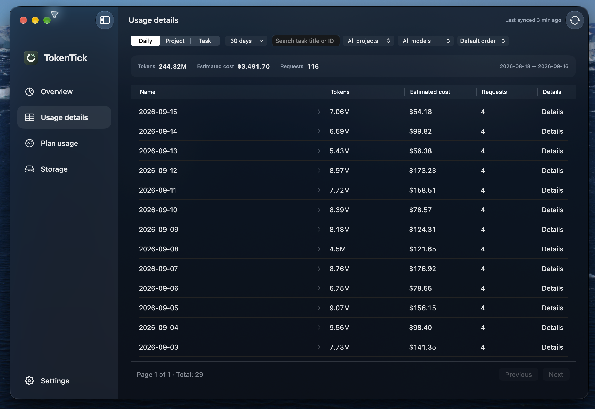
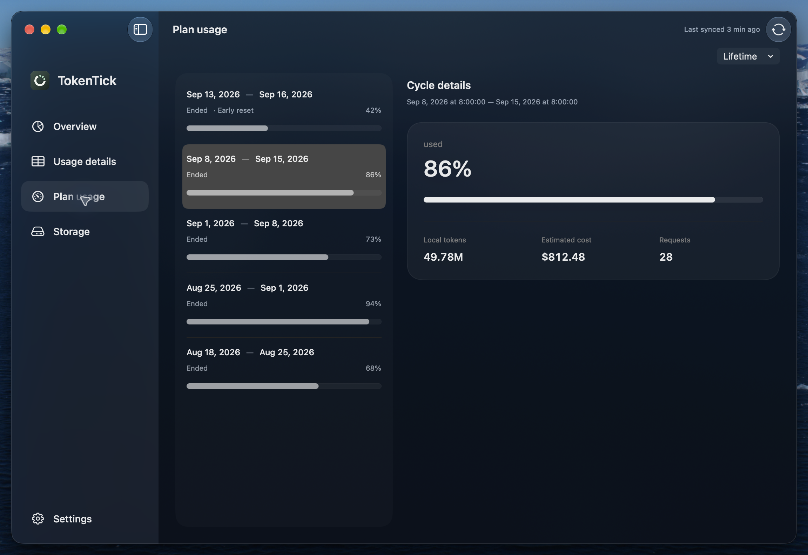
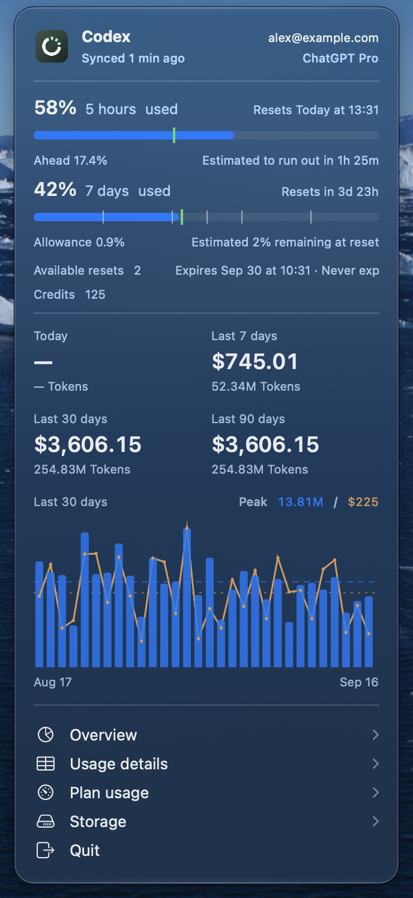

# TokenTick

A native macOS app and CLI for tracking **Codex usage limits, token usage, estimated API costs, and local storage**. A Codex-focused alternative to [CodexBar](https://github.com/steipete/CodexBar) and [ccusage](https://ccusage.com/guide/).

- Explore usage by day, task, project, and model.
- Monitor current limits and review completed weekly windows.
- Estimate when limits will run out or how much allowance will remain at reset, starting with the current cycle's average pace and adapting as new usage observations arrive.
- View available reset credits, their expiry dates, and the credits balance returned by Codex.
- Compare usage by model, usage mode, and reasoning effort.
- Inspect Codex disk usage by category and browse worktree and projectless task directories.
- Check recent activity from the menu bar.
- Export detailed usage as JSON with the CLI.
- Background CPU usage below 1%, with peak memory usage just one-fifth that of comparable tools.
- Account for Fast and long-context pricing, avoid double-counting cached input and reasoning output, and deduplicate inherited usage in forked tasks.

Requires **macOS 26+ and Apple Silicon**. Supports English and Simplified Chinese through macOS language settings. Costs are USD estimates based on public API prices, not subscription charges.

## Screenshots

Screenshots use sample data.

**Overview and limit forecasts**

See current limits, estimated exhaustion or remaining allowance at reset, available resets, and credits alongside token usage and estimated costs.



<details>
<summary>Model usage, storage, usage details, plan history, and menu bar</summary>

**Model usage and storage summary**



**Storage details**



**Usage details**



**Plan history**



**Menu bar**



</details>

## Installation

Download an archive from [GitHub Releases](https://github.com/yeliex/tokentick/releases). Verify it with the matching checksum file:

```sh
shasum -a 256 -c <archive-name>.zip.sha256
```

### App

Extract the archive, move `TokenTick.app` to Applications, and open it. If macOS blocks the ad-hoc signed app, allow it in System Settings → Privacy & Security after confirming the download's source.

Update through **Check for Updates…** in the app menu or Settings → About.

### CLI

In Settings → General → Command line, click **Install CLI**. TokenTick creates a symbolic link at `/usr/local/bin/tokentick`. Existing files or other links are not overwritten; the app reports conflicts and permission failures without requesting administrator access.

Keep TokenTick in Applications before installing the CLI. The linked CLI updates with the app. `/usr/local/bin` is on the default macOS shell PATH. If installation requires additional permissions, an administrator can create `/usr/local/bin` and install the link manually:

```sh
sudo mkdir -p /usr/local/bin
sudo ln -s /Applications/TokenTick.app/Contents/Helpers/tokentick /usr/local/bin/tokentick
```

For an independent installation, the full distribution also includes `bin/tokentick` and its required resource bundle. From the extracted directory:

```sh
mkdir -p "$HOME/.local/bin"
install -m 755 bin/tokentick "$HOME/.local/bin/tokentick"
ditto bin/TokenTick_TokenTickCore.bundle "$HOME/.local/bin/TokenTick_TokenTickCore.bundle"
```

Add `$HOME/.local/bin` to your PATH. This independent copy is updated manually and requires the resource bundle beside it.

## CLI

```sh
tokentick sync --scope all
tokentick usage --group day --json
tokentick records --limit 100
tokentick current-limits
```

Run `tokentick --help` for filtering, pricing, and export options.

## Diagnostics

The macOS app sends crash reports, sanitized operational errors, and session statistics to Sentry. An anonymous installation ID measures active installations and version adoption; it is not a Codex account or a count of people. Error reports include diagnostic messages and related file locations, with credential patterns redacted. Codex conversations, credentials, usage records, and full API responses are not intentionally collected. The CLI does not initialize Sentry.

## Documentation

- [Product requirements](docs/requirements.md)
- [Architecture and maintenance](docs/technical-design.md)
- [Contributor and agent guidance](AGENTS.md)
- [Icon assets](assets/icons/README.md)
